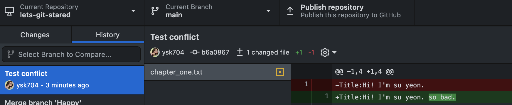
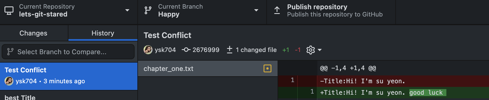
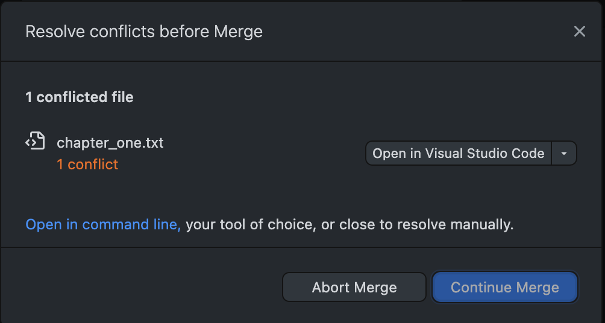
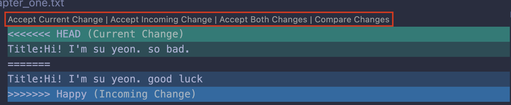

# [Git] Basic Git concepts

## 💡 what is Git and GitHub?

> **`Git`: 버전 관리 시스템 (Version Control System)** > **`GitHub`: 깃 레포지토리 저장소 (cloud-based hosting service)**

 

## 💡 repository

> **`.git/ folder inside a project`
> tracking all changes made to files in project**  
> if delete .git/ folder, you delete your project’s history.

 

## 💡 Commit

> **capturing a `snapshot of` the project's currently staged `changes`**

 

## 💡 Areas

> **`Working Area (untracked files)`** 
> local directory에서 존재하며 delete,edit,create 등의 활동이 일어나는 곳을 의미한다
> 이때 git은 이 파일을 tracking하지 않는다

> **`Staging Area (= index, cache)`** 
> 다음 커밋에 포함될 파일이 있는 곳이다.
> git은 최근의 commit과 새로 commit될 파일 간의 차이를 tracking한다.

> **`Repository`** 
> commit된 파일의 snapshot을 가지고 있다. working, staging area가 본래 어땠는지 알 수 있다.

 

---

## Branches

> **`has seperate timeline`**

> **`has all the histories of a main brach`**

> **`update main branch's changes to the branch`**

> **`merge branches to main branch`**

 

---

## conflicts in Branches

  

### [Editing same line on two branches]

### [conflict occured]

you can’t continue merge unless solve the conflict

 

### [VScode]

> **`Solve conflicts` by choosing one option out of four**
