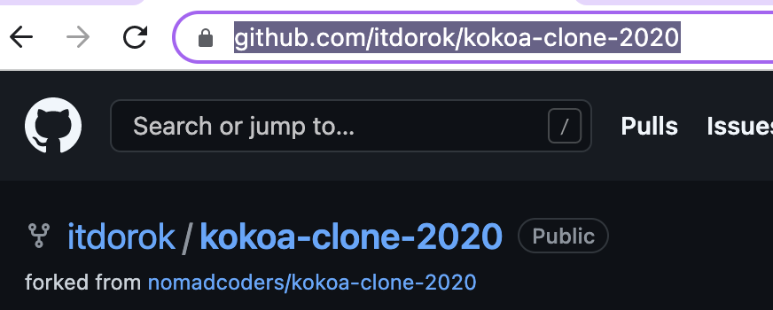
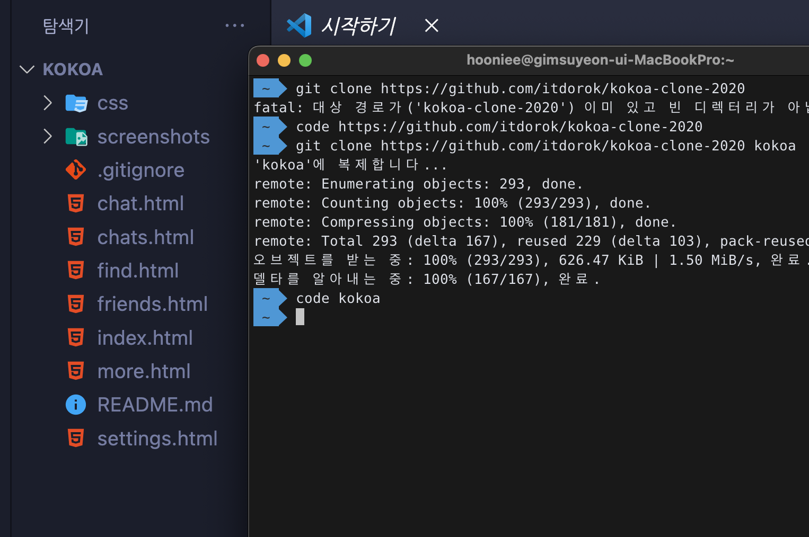

<style>
  .highlight {
    color: cornflowerblue;
  }
</style>

<h1 class="highlight">[Git] GitHub</h1>

```
1. fork
2. cloning
3. pull request
```

---

<br>

## 💡 fork

```
forking 한 repository가 내 repository로 복사된다.

단순히 다운로드 받으면 repository 생성 안됨
```



---

## 💡 cloning

```
forking한 repository를 local에 복제하는 것.
```

- terminal에서 clone하기
  
  <br>
- <b class="highlight">git clone</b> (생성된 repository 주소 (닉네임: kokoa))
- <b class="highlight">code</b> kokoa (이때 code command 설정 필수)
