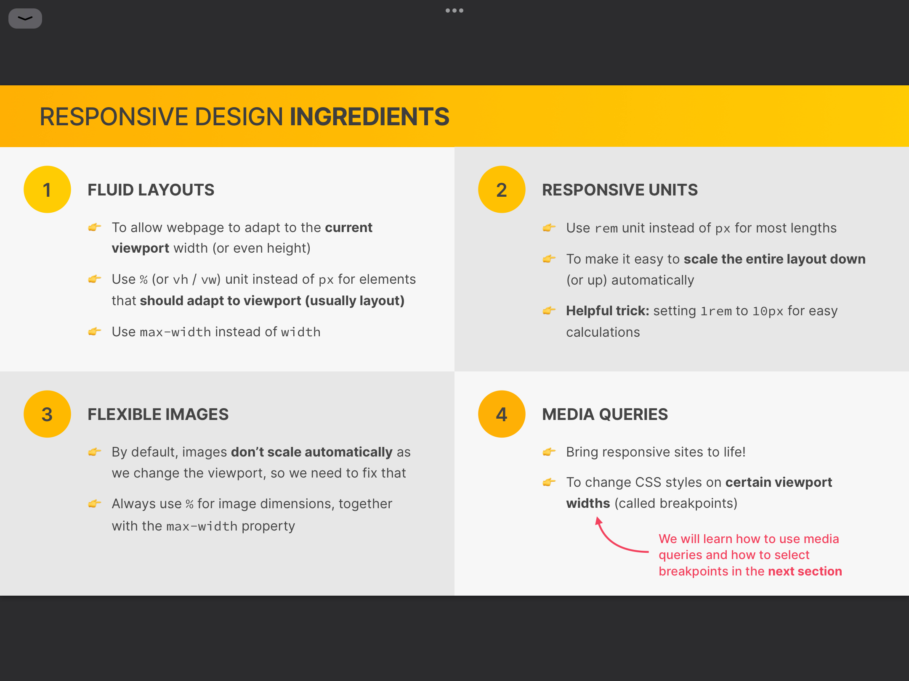

# Responsive design ingredients



## 💡 FLUID LAYOUT

```
- content가 현재 view port의 너비에 맞춰지도록 하기
- px 대신 % 사용
- width 대신 max-width 사용
```

#### + max-width

```
view port width = A
content max-width = B


A > B = B
A < B = A
```

## 💡 RESPONSIVE UNITS

```
rem = html font-size = by default 16px
```

```css
.container{
  width: 50rem;      (800px)
  padding: 2rem;     (32px)
  font-size: 1rem;   (16px)
}
```

---

#### + Trick 1

```css
html {
  font-size: 10px;
}
```

#### + Trick 2

```css
html {
  (10px / 1rem = 10/16 = 0.625 = 62.5%)
  font-size: 62.5%
}
```

default font-size 가 바뀌어도 %로 유기적인 font-size 설정 가능

---

## 💡 FLEXIBL IMAGES

```
px 대신 % + max-width 로 크기 지정
```

## 💡 MEDIA QUERIES
