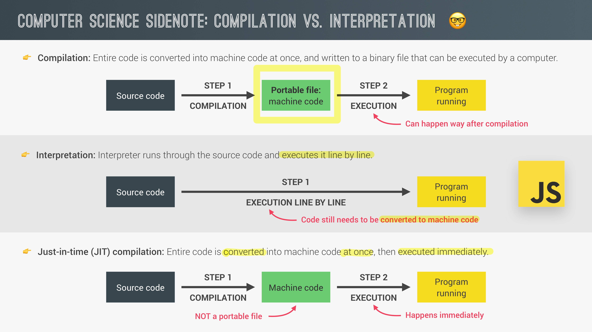
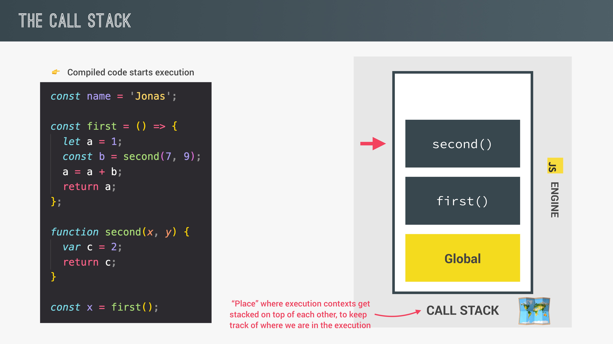
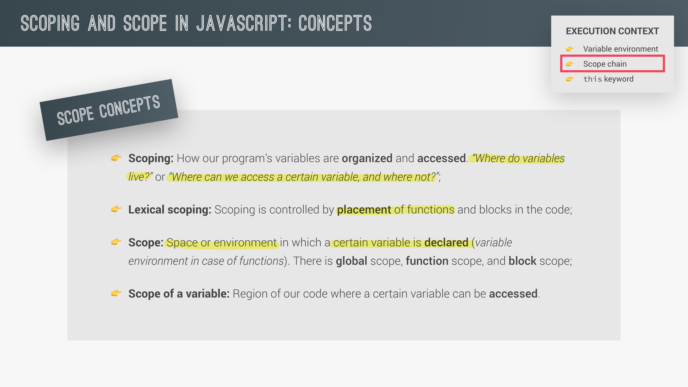
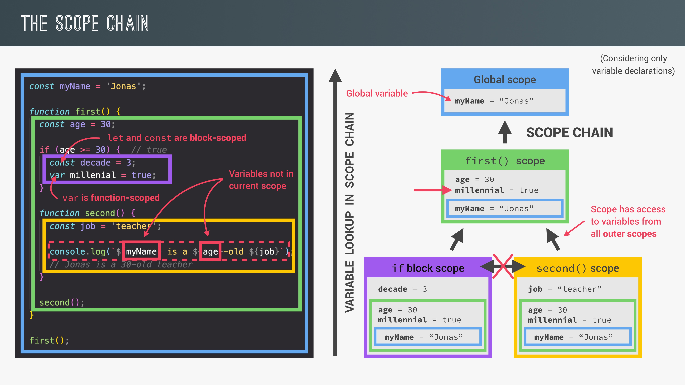
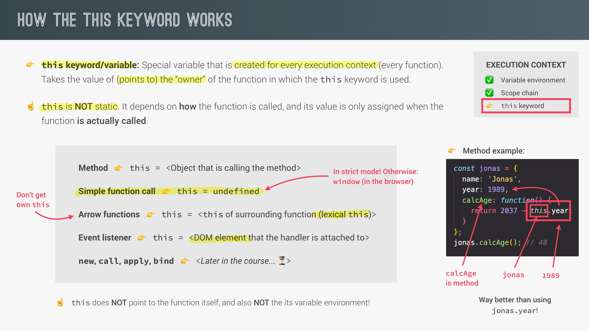
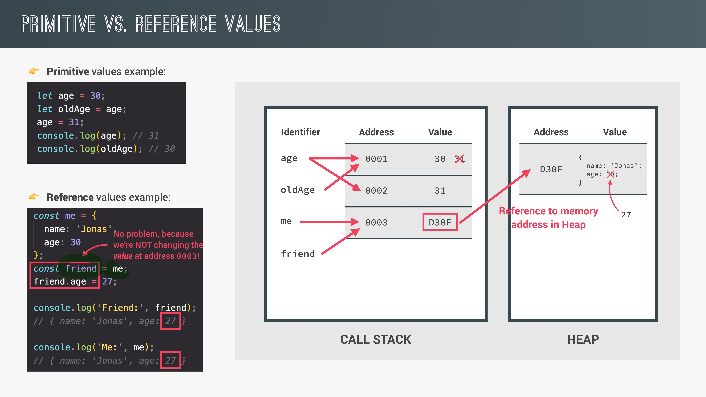

# JS Engine

    Program that executes JS code
    메모리에 저장하고 실행하는 call stack, heap이 존재

👀 막간 CS 상식



    기존 JS는 interpretation 방식으로 변환, 실행 했음
    속도 문제로 인해 JIT 방식이 선호됨

---

## **_Execution Context (EC)_**

## **_🌱 What is EC?_**

    자바스크립트가 실행되는 장소.
    코드가 실행되기 위해 필요한 정보가 저장되어 있다.

- JS에서 Global EC는 단 하나 존재
- function 하나마다 EC 하나씩 생성

## **_🌱 what's inside?_**

    1. Variable Environment
    2. Scope chain
    3. this keyword

---

### **_Variable Environment_**



    variable Environment

    * let, const, var declaration
    * functions
    * arguments object

### **_Scope_**



    Scoping: 변수의 유효 범위와 접근 방법을 고민하는 것
    Lexical Scoping: 함수의 선언된 순서가 아니라 선언된 위치로 결정됨
    Scope: 변수가 선언된 장소, 환경
    Scope of variable: 변수의 접근/유효 범위

**_The 3 types of Scope_**

    1. Global Scope
    어디서나 접근 가능한 변수

    2. Functon Scope
    함수 안에서만 유효함 바깥에선 접근 X
    부모함수 역시 자식 함수의 변수에는 접근 X

    3. Block Scope
    if/else, for 등의 block 안에서만 유효
    let, const만 해당함 (No var)

### **_Scope Chain_**



    함수가 바깥 함수로 '사다리'를 놓아서 찾고자 하는 변수가 있는지 살펴봄
    단, 바깥에서 안으로는 불가능
    같은 함수 안에 있어도 유효 범위에 따라 참조 불가능

---

## **_Hoisting_**

    변수가 선언되기 전 그 변수에 접근, 사용 가능한 현상

### **_Function declaration_**

```javascript
hi(); // hi 출력

function hi() {
  console.log("hi");
}
```

### **_var variable_**

```javascript
console.log(a); // undefined

var a = 123;
```

### **_let,const_**

```javascript
console.log(b); // uninitialized

const b = "I am su yeon";
```

    'let,consts는 hoisting이 이뤄지지 않는다'라고 하지만 사실은 일어나며 대신 var 변수처럼 undefined로 초기화되지 않으며 TDZ에 머묾

    TDZ (Temperal Dead Zone)
    let,const가 선언, 할당되기 전 잠시 변수에 접근 불가능 한 지역

### **_functions etc_**

```javascript
bye(); // bye is not a function

var bye = function () {
  console.log("bye");
};
```

    함수를 변수에 저장하면 값이 초기화 되기 전까진
    그냥 변수이기 때문에 bye의 type은 var의 초기값인 undefined

### **_this keyword_**



    모든 함수에 포함되는 개념, EC에도 저장됨
    해당 함수를 부른 'owner의 값'을 불러오는 키워드
    함수의 타입,call 방식에 따라 owner는 다르다

### **_Arrow function_**

    1. arguments object X
    2. this keyword X

```javascript
const me = {
  firstName: "yeon",
  lastName: "kim",
  age: 26,

  hi: () => {
    console.log(this.lastName);
  },
};

me.hi(); // undefined
```

    method는 자신을 호출한 obejct 전체를 불러오는데 hi는 키워드 자체가 없기 때문에 lexical this를 찾지만 me는 this 키워드가 없으므로 undefined

---

## **_Primitive vs Objects_**

    JS에는 값을 저장하고 불러오는 방식에 따라 두가지 값이 존재함

    1. Primitive - single value
    2. Object - multiple values



**_Primitive_**

    JS engine에 변수 이름, 메모리 주소, 값으로 저장되고 변수를 사용할 때는 값을 직접 부르지 않고 값이 저장된 주소를 가리켜 부름

**_Object_**

    call stack에 변수명, heap 메모리 주소 저장 >
    heap에 value 메모리 주소, value 저장

    call stack에서 heap 메모리 주소를 가리키고 value 값이 사용됨

---

### **_🚨 값 복제 문제_**

```javascript
let origin = 1;
let copy = origin;
origin = 2;

console.log(copy); // 1
```

```javascript
let me = {
  first: "yeon",
  last: "kim",
};

let copyMe = me;
me.age = 24;

console.log(me.age); // 24
console.log(copyMe.age); //24
```

    age값을 할당하지 않은 copyMe에도 me object처럼  age 값이 생김

---

### **_✨ Object . assign ( )_**

```javascript
const me = {
  name: "soo",
  age: 26,
};

const hi = Object.assign({}, me);
hi.job = "none";

console.log(hi, me); // hi만 job value를 가짐
```

🚫 **_문제점: 중첩된 inner object는 복사되지 않음_**
