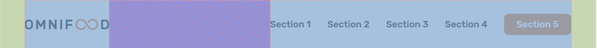
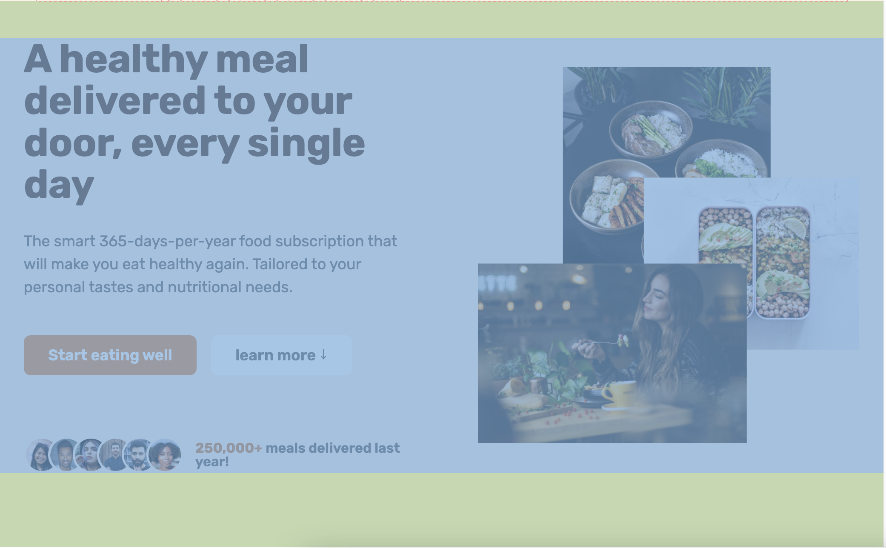

# header

## 💡 nav


<br>

```css
<nav>
  <ul>
    <li><a href="#">1</a></li>
     <li><a href="#">2</a></li>
  </ul>
</nav>
```

```
display: flex로 정렬
```

#### **_+ Trend_**

```
√ hero 페이지의 call-to-action button
√ nav의 마지막 link

같은 action을 하도록 하는 것이 트렌트
```

# section & div




```
√ section은 해당 페이지에서 긴밀하게 연결되어 소제목으로 나뉠 수 있는 부분
√ section은 다른 section과의 관계성 layout
√ section > div는 해당 section의 content의 layout
```

---

main page

- hero section

  - div

    - hero-text-box
    - hero-img-box

    .
    <br>
    .
    <br>
    .
    <br>

- other section

---
