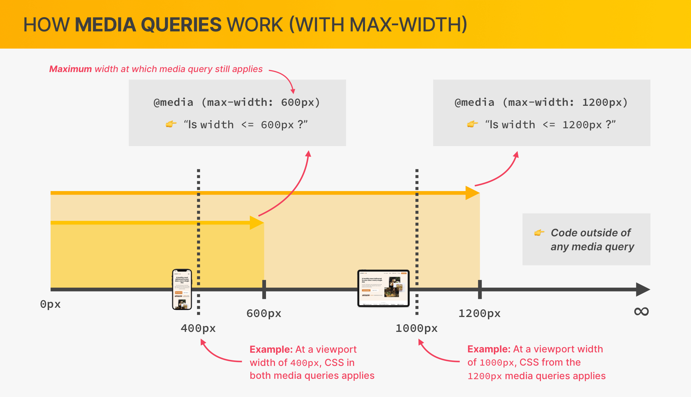
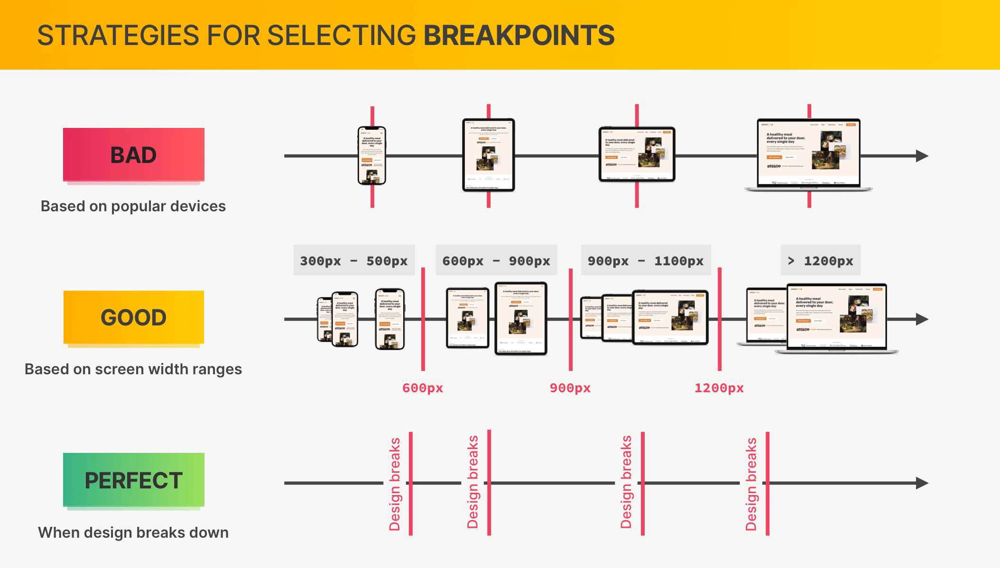

# media query (max-width)



```
√ 사용자마다 다른 크기의 디바이스를 이용하기 때문에 view port 크기별 디자인 필요
√ CSS가 적용되는 view port 최대 크기를 지정
```

## **_✅ perfect strategy_**

```
X popular device
X screen width
√ design breaks
```

디자인이 무너지는 지점을 max-width로 설정한다


