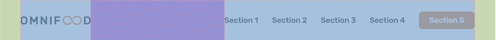
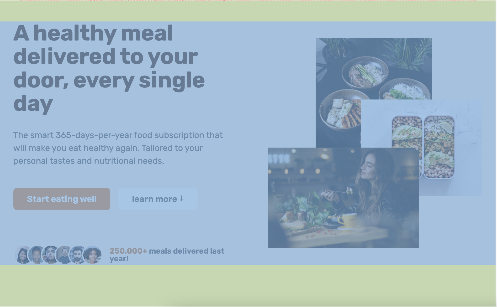
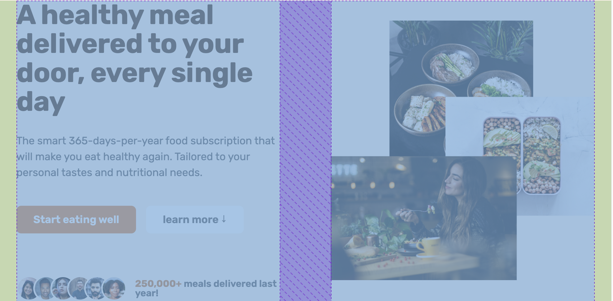
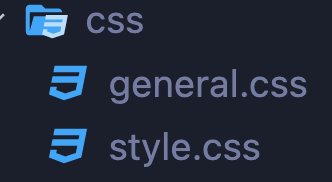

# header

## 💡 nav


<br>

```css
<nav>
  <ul>
    <li><a href="#">1</a></li>
     <li><a href="#">2</a></li>
  </ul>
</nav>
```

```
display: flex로 정렬
```

#### **_+ Trend_**

```
√ hero 페이지의 call-to-action button
√ nav의 마지막 link

같은 action을 하도록 하는 것이 트렌트
```

# section & div




<br>

```
√ section은 해당 페이지에서 긴밀하게 연결되어 소제목으로 나뉠 수 있는 부분
√ section은 다른 section과의 관계성 layout
√ section > div는 해당 section의 content의 layout
```

---

main page

- hero section

  - div

    - hero-text-box
    - hero-img-box

    .
    <br>
    .
    <br>
    .
    <br>

- other section

---

## 💡 section

```
√ background-color
√ padding-top/bottom
```

> 다른 section과 구분 되도록 큰 layout 지정

<br>

## 💡 div(container)

```css
.hero {
  max-width: 130rem;    (유동적 너비)
  margin: 0 auto;       (컨텐츠 가운데 정렬)
  padding: 0 3.2rem;    (뷰포트와 컨텐츠 간격)

컨테츠 레이아웃

  display: grid;
  grid-template-columns: 1fr 1fr;
  align-items: center;
  gap: 9.6rem;
}
```

> section안의 content 크기와 정렬을 담당

<br>

# Reusable components

```
√ margin: 0 auto (가운데 정렬)
√ display: grid
√ grid-template-columns
√ align-items: center

계속 사용하는 설정
```

>

```html
<div class="container grid grid--2-cols grid--center-v"></div>
```



```
reusable component별로 class를 만들어 사용,
CSS 파일을 따로 만들어 저장
```

<br>

# border & box-shadow

```css
a:hover,
a:active {
  /* border: 3px solid #fff; */
  box-shadow: inset 0 0 0 3px #fff;
}
```

```
hover 했을 때 border가 추가로 생겨서 화면이 움직이는 현상 해결
```
