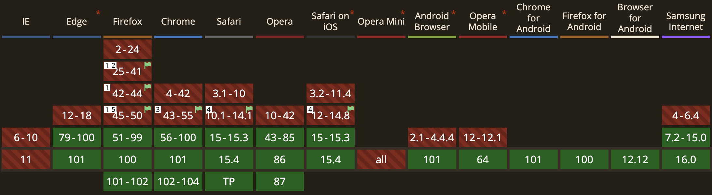

# Image optimization

[사진 압축 사이트 Squoosh 👀](https://squoosh.app/)
<br>
[호환 여부 사이트 caniuse 👀](https://caniuse.com/)

```
큰 크기의 사진은 사용자에게 부담이 되며
사진의 크기를 줄이되 quality를 유지하며 압축해야 함

이미지 파일의 크기를 직접 줄이고 첨부하는 것이 좋음
```

## webP

```
사진에 크게 손상을 주지 않으면서 높은 효율로 압축하는 방식

브라우저 호환문제가 있다
```



```html
<div class="hero-img-box">
  <picture>
    <source srcset="img/hero.webp" type="image/webp" />
    <source srcset="img/hero-min.png" type="image/png" />

    
  </picture>
</div>
```

호환 문제를 직접 판단하고 알맞는 fomat을 선택함

<br>
<br>
<br>

# meta

```html
<head>
  <!-- description -->
  <meta
    name="description"
    content="Omnifood is an AI-powered food subscription that will make you eat healthy again, 365 days per year. It's tailored to your personal tastes and nutritional needs."
  />
  <!-- Always include this line of code -->
  <meta name="viewport" content="width=device-width, initial-scale=1.0" />

  <!-- icon setting for different os -->
  <link rel="icon" href="img/favicon.png" />
  <link rel="apple-touch-icon" href="img/apple-touch-icon.png" />
  <link rel="manifest" href="manifest.webmanifest" />
</head>
```
