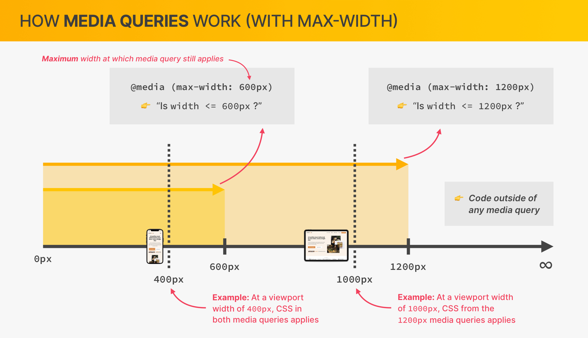
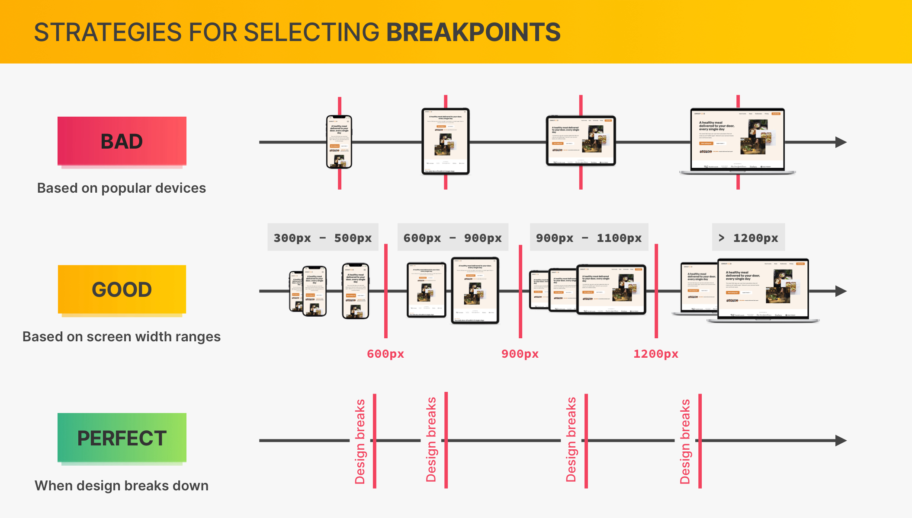

# media query (max-width)



<br>

```
√ CSS가 적용되는 최대 화면 너비를 지정
√ 범위가 겹치는 경우 selector specificity나 선언 순서에 따라서 적용됨
√ width는 em으로 설정
```

<br>

## ✅ perfect strategy : design breaking down



<br>

```
√ 설계한 디자인이 무너지는 구간을 기준으로 재설정
√ 디바이스 크기에 상관없이 잘 작동하는 장점
```

---

<br>

## font-size

<br>

```css
@media (max-width: 75em) {
  html {
    font-size: 56.25%;
  }
}
```

```
기존 62.5% (10px)에서 56.25% (9px)로 바꾸면서 rem,em으로 설정한 모든 요소의 크기를 한번에 변경
```

## em, rem

[상대단위 em과 rem 비교 👀](https://www.daleseo.com/css-em-rem/)
<br>
<br>

---

## **_mobile nav bar_**

```
창의 크기가 줄어들면 상단의 navigation을 토글 형식으로 바꿔주어  layout의 효율을 늘린다.
```


